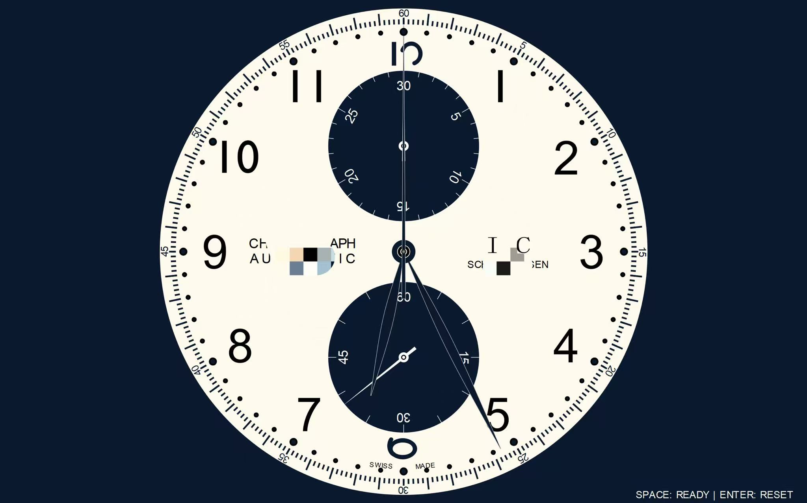

# IMC Chrnongreph

一个用 PyQt5 制作的计时码机械表表盘高度模拟表屏保程序，包含时、分、秒针、计时功能和小秒盘。

## 效果预览



## 功能特点

- 🕐 平滑运动的时、分、秒针（包含指针银色描边）
- ⏱️ 计时码表功能（按空格键开始/暂停，按回车键重置）
- 📊 小秒盘（6点位，中央大秒针为计时秒针，按空格键才会开启计时）
- ⏲️ 计时分针盘（12点位）
- 🖥️ 全屏显示

## 操作说明

- 按 **空格键 (Space)**：开始/暂停计时
- 按 **回车键 (Enter)**：重置计时器

## 运行方法

### 1. 安装依赖

```bash
pip install -r requirements.txt
```
### 2. 运行程序
```bash
python IMC-GIT.py
```

## 依赖库
PyQt5>=5.15.0

calendar

datetime

## 许可证
MIT License

## 免责声明
本项目为个人学习与技术交流之目的，仅供非商业用途使用。

代码仅为模拟计时码表功能的技术练习，不隶属于任何钟表品牌
